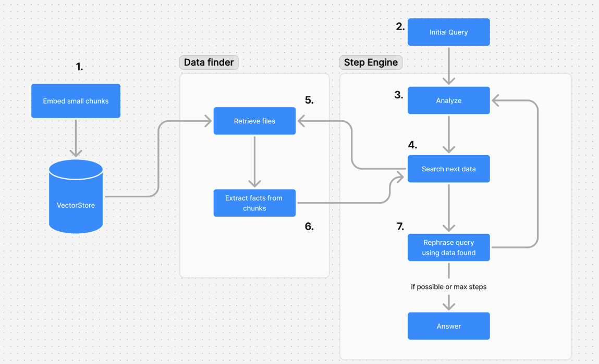

# Iterative Agentic RAG

The Iterative Agentic RAG is a proposition of Retriever Augmented Generator suitable for multi-hop queries, and able to answer reasonning dependant questions with small opensource models.

Imagine you have to read a book. You follow the story and you go on. But if you have to answer questions about the book, you will have to go back and read parts of the book again.

If the question deals with a specific character, you will focus your attention on the parts of the book talking about this character.

If the question deals with a specific place, you will focus your attention on the parts of the book talking about this place.

That's what this Iterative RAG does, by extracting question specific informations from a text.

## 🚀 Launch

Create `.env` file with your NVIDIA NIM api key and other.
Default and fast LLM models are best with `nvidia/nemotron-4-340b-instruct`.
Reranker if optional but this was tested with `nvidia/llama-3.2-nv-rerankqa-1b-v1`.

Launch Qdrant vector store: 
```
docker run -p 6333:6333 -d  -v $(pwd)/qdrant_storage:/qdrant/storage qdrant/qdrant:latest
```

Init data, this will download wikipedia data needed for evaluation.json tests and then embed the files
```
npm run init
```

Finally, go test the RAG :
```
npx ts-node src/index.ts
```


## ⚙️ Principles

In the schema below, we see the 10 steps from the initial documents embedding to the answer to a complex query.



1. Initial document embedding. Chunks size must be small : 500 characters with 80 characters window show a good performance. This will ne be used to retrieve data.
2. Let's now go to the main engine `Step engine`. We send the user query to the IterativeAgenticRAG agent, it will take care of everything. This agent is a JavaScript class that will analyze, simplify, find data and answer to the question.
3. The analyze phase aims to find the next data you would need to answer to the question. For example, "What is the name of the first lady of the 15th president of the USA ?", you will need to find who is the 15th POTUS, then, find the name of his wife or first lady. This step take the query and can also return the answer directly if the query is simple enough.
4. We need to find the next needed data, for example the name of the 15th POTUS. We will ask this to the `Data Finder` component. If the analyze found the answer, we just return the answer.
5. Remember step 1, we embeded the files of our knowledge base. We will use them to find a sublist of file where we could find the data we need.
6. With the sublist of file, we will read them one by one, asking a model to extract informations in relation with the data we are looking for.
7. When we collect more than a limit number of informations, we consider we have enough informations to give to the `Step Engine`
8. We have data and a complex query, let's rephrase the query to simplify it. For exemple, we found the name of the 15th POTUS, we rephrase the query this way : "What is the name of the first lady of James Buchanan". This is way more simple to understand right ? The engine will launch another loop till it reaches a loop limit number. When the query is still too complex and the loop limit number is reached, whe ask a model to try to answer it for the last time and return its answer.

## ⁉️ Why ?

This RAG architecture was made to address a specific problem of RAGs : Asking quantitative or qualitative informations on the same embeddings can make our lives difficult. Small chunks are good for quantitative questions, large chunks and summaries are good for qualitative questions.

Our assertion : We don't know what the user will ask when we create a RAG. So, let's be radical, search data on-demand, the model will understand a given text from the user's point of view.

Second assertion : Asking an agent to extract specific data is easier for small/medium models and prevent hallucinations and errors. 

This architecture has been developped for the NVIDIA Developper Contest (https://developer.nvidia.com/llamaindex-developer-contest) with LlamaIndex.

We chose the [LlamaIndex](https://github.com/run-llama/LlamaIndexTS) Typescript version in order to test the TS version of the framework. This is really easy to use and it makes it easier to integrate LLM component into existing web infrastructures.


## 🔎 Quality evaluation

Creating a RAG can be more or less easy. Looking for quantitative information into a text is not the hardest thing in the world but adding a multi-hop capacity can make it a lot more difficult. That's it has been chosen to use the Google RAG benchmark dataset (https://huggingface.co/datasets/google/frames-benchmark). It is composed of a list of questions and sources with the corresponding answer.

The development has been evaluated with the first queries and this project could be improved by adapting the architecture of the Iterative Agentic RAG to be more efficient on different kind of queries.


## 💬 Developper thoughts

* The NVIDIA NIM service is great but working on this project consumed A LOT of credits. Then, it has been chosen to make first tests with different services that makes the source code more "meta" level. LlamaIndex is made to be able to use LLMs like Grok, Ollama, NVIDIA, etc. The Iterative Agentic RAG is a class using LlamaIndex abstract classes to be able to work with different LLMs/Embeddings/Rerankers, etc.
* LlamaIndex `SentenceSplitter` failed with a bug about "max stack size exceeded" when the document is too long, so I used a simpler function to split the texts.
* Agentic data extraction is slow and energy consumer. We should add data into a vector store in order to cache data in a database without having to call a model again.
* During development the NVIDIA API used to return 4XX errors on models. 404 error on embedding API, "no body" error on some models, etc. For these reasons, I used Ollama embeddings as they are locally running and their size and quality are smaller than NVIDIA's. The quality of the results should then be greater with NVIDIA API.
* For NVIDIA contest, I keep most of the example with NVIDIA NIM API. But the Iterative Agentic RAG is meant to be usable with any embedding, LLM, Reranker supported by LlamaIndex 👀
* It is about 13 days of development since I started this contest. The model evaluation, prompt engineering took a lot of time. I really improved my methodology : First make spikes/POCs in order to test different approaches. Make spikes to test prompts and models. Then go for the real product and make the end-to-end functions/classes. Then improve the prompts during testing. LLMs are great, but we need to learn how to talk to them 😅
* Node cache is used to improve testing cost and speed. Node cache has been integrated into the `product` source code to prevent cost go *"to the moon"* during tests. Also a good pracitice to adopt while programming on LLMs.


## 📁 Files

- img: Schema for this file
- input_wikipedia: Will contain text version of wikipedia articles used for tests
- src: Sources
  - scripts: Init script to download and parse Wikipedia pages used for evaluation tests
  - tools: Functions used to split text and WikipediaTools to improve LlamaIndex's version (with infobox and tables)
  - iterativeragagent.ts : Should be sent to LlamaIndex repository if they want it ;)
- evaluation_60.json & evaluation.json : Partial evaluation tests from Google RAG benchmark dataset. `evaluation.json` contains a subset to make dev tests.


## ⚙️ Requirements 

- NodeJS 22.x (a bug will occure with previous versions)
- Ollama / NVIDIA NIM API Key / Groq API Key
- Minimal model : `llama3.1:70b` for minimal quality, 8b would make quality too low to be usable. First tests on `llama-3.2-90b-text-preview`.
- The simplest vector store used with LlamaIndex with TypeScript is QDrant. You shall launch a local QDrant server with : `docker run -p 6333:6333 qdrant/qdrant`


## 😡 Criticism

This work is just the beginning, all elements are Ok and the quality can be improved :

- Summaries support : Should be able to extract summaries from large chunks instead of "short facts". Would be important to handle qualitative searches on the corpus
- Test more questions from the Google RAG benchmark dataset which is pure evil for RAGs 😅


## 🥊 Challenges during development

* Development loop to choose the good model depending on a prompt which itself evolves during the dev
* Before adding the reranker into the agent, it gave a correct answers to the evaluation tests questions, but when the reranker has been added, it showed the quality of the prompt and the former method was not good. I then had to change lots of source code in order to improve the quality of the "iterative loop". Then the reranker has been added and the agent started to return more consistent results. I should have developped a complete process e2e ASAP in the coding process so that the reranker would have shown the problems earlier.
* NVIDIA API showed some bugs on some models
* LlamaIndex TS is less mature than Python library. The NVIDIA LLM/Reranker/Embeddings are not supported yet and I had to code some classes to use NVIDIA products with LlamaIndex. Not prefect but it was supplemntary development. I also used the react agent of LlamaIndex as a base for the project's agent, using the llamaindex agent template to run it.
* Such a project needs to test a lot of approaches, embed a lot of documents, multiple times. The quantity of credits available on the API platform is not sufficient for a RAG development. I had to use a local embeddings service (Ollama) to keep some credits for the reasonning and reranking parts.
* I was supposed to use NEMO curator (find documents on the web instead of wikipedia tool) and GuardRails (Add some guardrails for the answer and eventually during the process in order to keep control on facts found) but I would have need 1 or 2 more weeks to make it.
* It was funny though ...